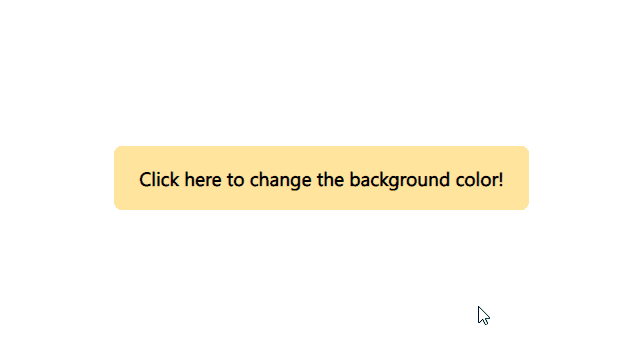

# Random-Background-Color-Modifier 

Hi, everyone! In this repo, I improved my knowledge of DOM(Document object model).

What I used?

- JS Math
- Js Random
- Js DOM

[Click Here For Preview](https://yasingultekin.github.io/Random-Background-Color-Modifier/)

